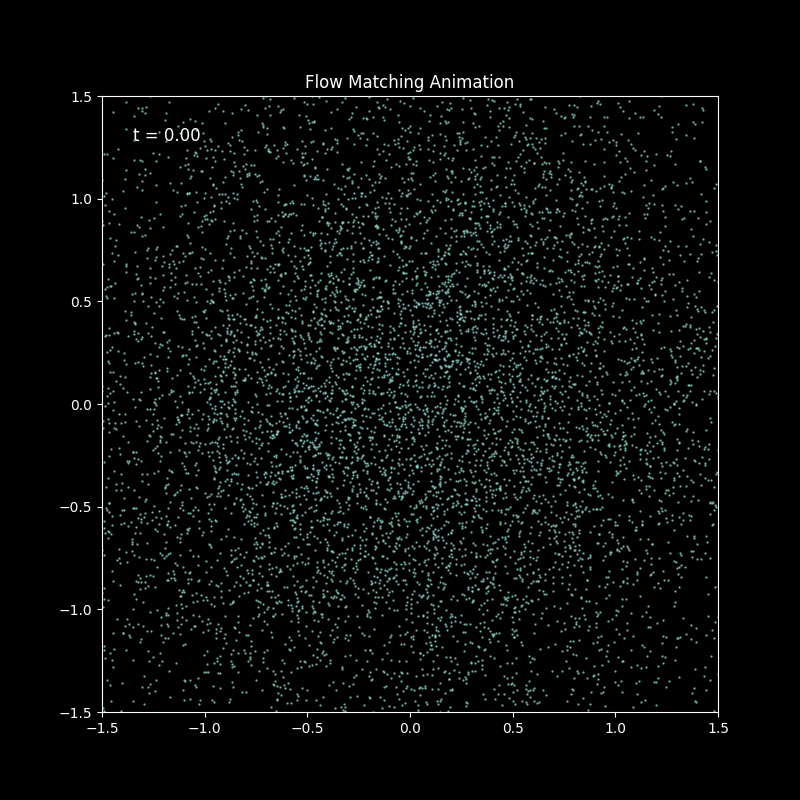

# Seminar on Scientific Machine Learning in Physics
### Likelihood based Generative Modeling: Variational Autoencoders and Normalizing Flows

Our Code for the Scientific Machine Learning for Physics Seminar.
You can find multiple notebooks that can be run in google colab. 

