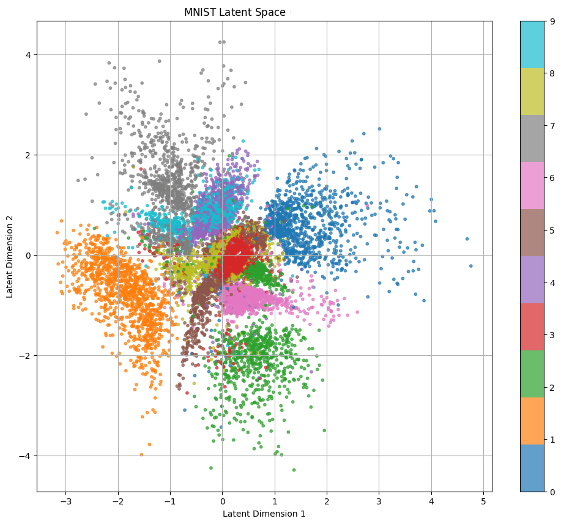
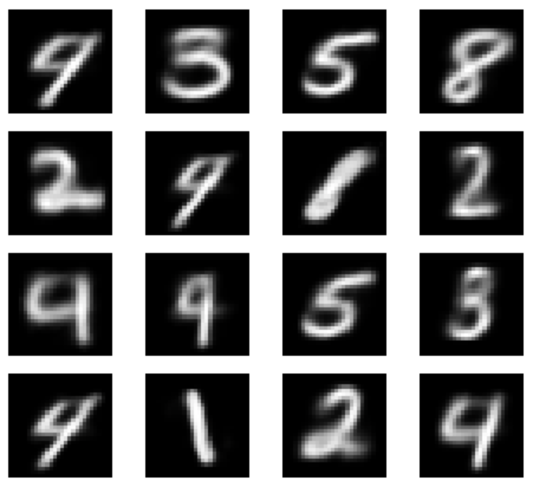
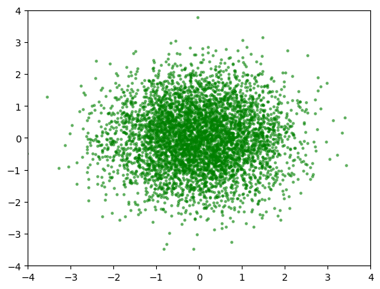
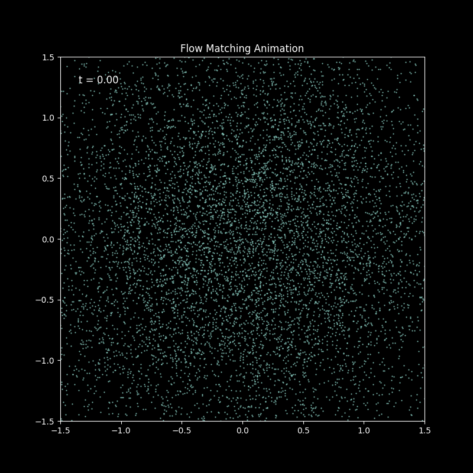

# Seminar on Scientific Machine Learning:  
Likelihood-based Generative models: VAEs and NFs

**Authors:** Elias Huber, Sam Rouppe Van der Voort

## Abstract
This Document summarizes the Seminar talk on "Likelihood-based Generative Models: VAEs and NFs" of the Scientific Machine Learning Seminar. We first introduce Likelihood-based models in a general scope. We then continue with deriving the theory behind Variational Autoencoders and Normalizing Flows. We also give small example implementations for both to give a proof of principle. We then proceed with two experimental tasks, where we use the presented methods to train models for learning the distribution generated by a QR-code and an image generation model that uses Normalizing Flows and Variational Autoencoders together to generate and classify images of fruit. Finally, we conclude our presentation by discussing the possible applications in physics.

## Introduction
In recent years, Likelihood-based generative models have had a significant impact in fields like image generation \cite{} and protein design \cite{}. Two foundational methods of this field are Variational Autoencoders (VAEs) \cite{kingma2013autoencoding,kingma2019introduction} and Normalizing Flows (NFs) \cite{rezende2015variational,papamakarios2021normalizing}.  
In this article, we will present and discuss both of these methods, provide implementation examples, and discuss their applications in physics.

## Likelihood-based Generative Modeling
Likelihood-based generative modeling deals with the issue of generating new samples that match the characteristics from a given dataset. Mathematically, we have a given dataset $\mathbf{X} = ( \mathbf{x}_{1}, \mathbf{x}_2, \ldots, \mathbf{x}_{n} )$ from which follows an underlying data distribution $p(\mathbf{x})$. To sample and evaluate new data, we want to find a distribution $p_\theta(\mathbf{x})$ that approximates the underlying true distribution $p_(\mathbf{x})$ that the data follows. For this, we want to optimize our selection of the parameter $\theta$ such that it matches the original distribution the best. This is done by maximizing the likelihood

$$
     \mathcal{L}(\theta) = \prod_{i=1}^{n} p_\theta(\mathbf{x}_i)
$$

that we observe our data, given our approximation of the probability distribution $p_\theta(\mathbf{x})$ with parameters $\theta$. In practice, we model our approximation distribution $p_\theta(\mathbf{x})$ with neural networks and minimize the negative log-likelihood

$$
    \hat{\theta}_{MLE} &=  \arg \min_{\theta} J(\theta, \mathbf{x}^{(1)}, \cdots, \mathbf{x}^{(n)}) \\ 
    &= \frac{1}{n} \sum_{i=1}^{n} - \log p_{\theta}(\mathbf{x}^{(i)}),
$$

to find the optimal weights of the neural network. We minimize the log-likelihood due to numerical stability. The parameter optimization process is then done using gradient descent-based algorithms.

## Variational Autoencoders
### Theory
Variational Autoencoders (abbreviated VAEs) introduced by Kingma et al in \cite{kingma2013autoencoding}, are conceptually similar to Autoencoders (abbreviated AE). The main idea is to encode data in a lower-dimensional latent space and then to recreate or create new data from the latent space. Practically, both architectures achieve this by consisting of an encoder and a decoder. Unlike AEs, which encode each data point to a point in the latent space, VAEs encode each data point to a distribution in the latent space. This is achieved by the encoder and decoder approximating conditional probability distributions. In particular the probability of a latent state given a data point $p(z|x)$ and the probability of a data point given a latent state $p(x|z)$.
For VAEs both distributions are approximated with neural networks $p(z|x) \approx q_\phi(z|x)$ for the encoder and $p(x|z)$ for the decoder we approximate $p(x|z) \approx p_\theta(x|z)$ with parameters $\phi$ and $\theta$ respectively. 

### ELBO
As discussed before VAEs are a subclass of likelihood based modeling. So we want to maximize the log likelihood to obtain the loss function for the VAEs. An exact solution is not tractable but we can obtain a lower bound. This results in the ELBO, the loss function to achieve the approximations of the conditional probability distributions. 
The ELBO is the expectation value, wrt. samples from the encoder probability distribution $q_{\phi}$ expressed as follows: 

$$
    \text{ELBO}(x) = \mathbb{E}_{q_\phi(z|x)} \left[ \log \frac{p(x, z)}{q_\phi(z|x)} \right]
$$

$$
    = \underbrace{\mathbb{E}_{q_\phi(z|x)} \left[ \log p_\theta(x|z) \right]}_{\text{Reconstruction}} 
    - \underbrace{D_{\text{KL}}(q_\phi(z|x) \,\|\, p(z))}_{\text{Regularizing}}.
$$

We see that the ELBO can be split up into a reconstruction term and a regularizing term. 
Depending on the assumed distribution of the target the reconstruction term becomes the MSE for gaussian assumtion or BCE loss for bernoulli assumtion. Ensuring a good reconstruction. While the regularizing term enforces the encoder distribution to resemble the assumed prior in latent space, which for the normal VAE case is standard gaussian. 

### Reparameterization trick
For calculating the ELBO in practice the reconstruction term $\mathbb{E}_{q_\phi(z|x)} \left[ \log p_\theta(x|z) \right]$, we rely on samples $z$ from the learned distribution $q_\phi(z|x)$. This leads to the problem of calculating gradients wrt. $\phi$ since the sampling is not differentiable. To circumvent this problem, Kingma et al. \cite{kingma2013autoencoding}) proposed a so called reparameterization trick. The transformation $z = \mu_\phi + \sigma_\phi \odot\epsilon$ in terms of the distribution parameters $\mu_\phi$  and $\sigma_\phi$ from $q_\phi(z|x)$ makes the sampling independent of $\phi$. The stochastic variable $\epsilon$ is sampled form a standard normal distribution $\mathcal{N}(0,\text{I})$ and due to the properties of Gaussians, the distribution of $z(\mu_\phi, \sigma_\phi,\epsilon)$ will be $\mathcal{N}(\mu_\phi,\sigma_\phi)$. So the distribution of $z$ remains unchanged and the transformation allows samples of $z$ to be differentiated wrt. $\\phi$ since the stochasticity now is in $\\epsilon$. 

### Implementation: MNIST
For a showcase of VAEs we implemented a VAE for generating new MNIST-like images. We did this with torch by using feedforward neural networks for the encoder and decoder networks, approximating $p(z|x) \approx q_\phi(z|x)$ and $p(x|z) \approx p_\theta(x|z)$. We also visualized the latent space and thus choose a latent dimension of 2. (See Figure \\ref{fig:latentMNIST}). Further more, we explored the continuity of the latent space by interpolating between two encoded images, decoding along the way. The result in (fig/gif). Finally, we also generated new MNIST-like images, see Figure \\ref{fig:genMNIST}. The code can be seen on the github in the notebook MNISTVAEs.

*Figure: Latent distribution of encoded images, colored by label.*

*Figure: Novel MNIST images generated with trained VAE.*

## Normalizing Flows
### Theory
Normalizing flows have a different approach than VAEs presented before. Instead of learning our target distribution directly, we learn a transformation $f$ from a base distribution  $p_Z(\textbf{z})$ to our target distribution $p_X(\textbf{x})$. This enables us to efficiently sample from our target distribution, by sampling from the base distribution and transforming the sample to the target space. Mathematically, we utilize the change of variables formula

$$
     p_X(\textbf{x}) = p_Z(f(\textbf{x})) \left| \det J_f(\textbf{x}) \right|^{-1} 
$$

to find our transformation. Here, $f(\textbf{x})$ is a bijective function $f:\mathbb{R}^d\rightarrow\mathbb{R}^d$ that transforms both equally dimensional probability spaces into each other. The significant part of this equation is the calculation of the normalization constant, given by the determinant of the Jacobian matrix of the transform $\left| \det J_f(\textbf{x}) \right|^{-1}$. This restrains our implementation of the transformation function $f(x)$ to be invertible and differentiable. We thus need to use invertible and fully differentiable neural networks to implement the transformation.

### Coupling Flows
One prominent example of a normalizing flow implementation is the so-called coupling flow. Here, we split our input data in two parts. While we leave the first part of the input dimensions unchanged, we use them as input to a neural network that outputs a transform that acts on the second part. This neural network is also called a coupling network. The schematic structure of such a coupling network can be seen in Figure \\ref{fig:coupling_transform}. This kind of flow is useful since the Jacobian of the transformation takes the form of a lower triangular matrix, which reduces the complexity of the determinant calculation from $\mathcal{O}(d^3)$ to $\mathcal{O}(d^2)$, where $d$ is the dimensionality of the distributions.

*Figure: Schematic of a coupling flow.*

### Composition of Flows
To enhance the expressiveness of normalizing flows, it is possible to concatenate multiple normalizing flow transforms, to divide the task of finding the proper transform into multiple sub-tasks

$$
    f = f_K \circ f_{K-1} \circ \cdots \circ f_1.
$$

The determinant, necessary for normalization then can be calculated with the relation

$$
    \det J_f = \det J_{f_K} \cdot \det J_{f_{K-1}} \cdots \det J_{f_1} = \prod_{k=1}^{K} \det J_{f_k}.
$$

This trick greatly increases the expressive power of normalizing flows while keeping computational cost low, by implementing simple transforms like the previously shown coupling flows and concatenating them to achieve higher expressiveness

### Implementation
For a proof of concept, We used normalizing flows to learn a double-peaked gaussian in two dimensions. For that, we defined the standard 2D gaussian as the base distribution. For the normalizing flow, we concatenated eight coupling transforms that use affine transformations as coupling networks. The implementation was done in python, using the nflows library with torch. The base, target and generated distribtions are shown in Figures \\ref{fig:nf_base}-\\ref{fig:nf_target_generated}

*Figure: Left: Samples from the target distribution. Right: Generated samples using normalizing flows.*

## Experiments
To test the limits of these methods, we implemented two case studies where we tried to bring both methods to their limits.

### Learning the distribution of a QR code
In an effort to probe the expressiveness of normalizing flows, we tried to learn the distribution that is obtained by transforming the QR-Code of our Github repository into an uniform distribution (see Figure \\ref{fig:nf_qr_pic}). We first tried to use different types of normalizing flows to learn the transformation from a standard 2D Gaussian to the underlying distribution of the QR-Code. We observed that the method failed to capture the fine structure of the QR code pixels. We thus modified our approach to use a more advanced and computationally more efficient approach to the problem: Flow matching. Here, instead of finding discrete transforms, we try to find a continuous velocity between the times 0 and 1, to push our samples forward using an ODE integrator.  
The resulting generated distribtion looked more like a QR code but was still not scannable. The sharp edges of the pixels were limiting the performance. We thus extended our transformation to also learn the Fourier features of the target distribution, to increase the precision for high frequency features like the sharp edges of the pixels. This led to the ability to recreate the QR-code distribution to high accuracy. The result is shown in Figure \\ref{fig:qr_combined}.

*Figure: Left: Target QR code. Right: Generated samples using flow matching.*

### Image generation of Fruits
For further showcase of VAEs we implemented a VAE for generation of fruit images. We used a CNN based architecture for the encoder and decoder to capture the finer features of the fruit images. The data used was around 1400 images from \cite{sshikamaru2020fruit} of approximately equal share, apples, kiwis and bananas. The generation of new samples was not so successful so we tried to improve our model by adding normalizing flows of the latent distribution to improve the flexibility of the encoder $q_{\phi}$.

#### Adding NFs for more expressive a more expressive latent space
Transforming the latent space with flows increases the flexibility of the latent distribution. Specifically we implemented  inverse autoregressive flows (IAFs) which was suggested for VAEs by Kingma in \cite{kingma2016improving}. The IAF flow expression is $z^{(t)} = \mu^{(t)}(z^{(t-1)}) + \sigma^{(t)}(z^{(t-1)}) \odot z^{(t-1)}$. The transformation is performed up to T times since we can compose multiple flows. Notice that the form of the transformation is similar to the reparameterization trick, here however the composition of flows  Which has desirable properties for a normalizing flow as it is invertible and yields a triangular Jacobian. The code can be found in the notebook FruitVAEsNFs. Visually we did not see an improvement and propose that we need more data for the VAE to efficiently learn the fruit image distributions. 

#### Latent space exploration
For both the purely Fruit VAE with CNN architecture and the one with additional normalizing flows in the latent space the we did similar linear interpolation between encoded images. Here the latent dimension however is much greater than for the MNIST example set to 128 and 64 respectively. See gif \\ref{}. We also suspect that the VAE struggles with recreating good images but is able to separate the fruit classes since we tried sampling from the neighborhood of a encoded sample and got blurrier versions of the encoded images, not complete nonsense or images looking like one of the other fruits. This was not explored further.

## Applications in Physics
Likelihood-based generative models are used predominantly in two different modes. We either want to generate new samples that weren't in the training set, or we want to evaluate the probability of new samples we observe.

### Generating new samples
VAEs and NFs are both used for generative models, even though they are not state-of-the-art in some cases. Application fields include chemical design \cite{gomez-bombarelli2018automatic} and generation of rare galaxy images for telescope calibration \cite{ravanbakhsh2016enabling}.

### Evaluating samples
Both VAEs and NFs are used to evaluate sample probabilities. Since VAEs only evaluate the ELBO, they are mainly used for anomaly detection \cite{pol2020anomaly}. NFs can also be used to efficiently evaluate more exact probabilities, like they are necessary for Markov Chain Monte Carlo methods \cite{roggero2021normalizing}.

## Summary
VAEs and Normalizing flows are two powerful methods for generative modeling. The VAEs learn how to approximate the data distribution trough a encoder-decoder structure similar to a AE but where the latent space is easy to sample from distribution. Normalizing flows essentially learn invertible coordinate transformations to transform a easy to sample distribution to a more complex one. Our simple examples, the MNIST and 2D two peaked gaussian, showcase how one could approach implementing the two methods, and the example of the QR code and turning apples into bananas shows how one could extend the implementations for other specific use cases.

\bibliographystyle{alpha}
\bibliography{sample.bib}

